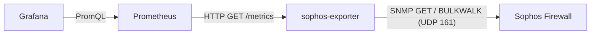

# sophos-exporter

[](https://github.com/t0mer/sophos-exporter/actions/workflows/ci.yml)
[](LICENSE)

A single, static, headless [Prometheus](https://prometheus.io/) exporter that
reads a **Sophos Firewall (SFOS)**, such as an XG or XGS appliance or the
virtual SFVH, over **SNMP**. It exposes the results on `/metrics` for a Grafana
dashboard.

- **Stateless:** no database and no persistence. Every Prometheus scrape triggers
  a live SNMP read of the firewall (scrape-on-request, no background poller).
- **SNMPv2c and SNMPv3** are both supported. For v3 you can use
  `authPriv`, `authNoPriv` or `noAuthNoPriv`, with MD5/SHA-family authentication
  and DES/AES-family privacy.
- **Single static binary** (`CGO_ENABLED=0`) and a multi-arch Docker image
  (`linux/amd64`, `linux/arm64`, `linux/arm/v7`) on a `scratch` base, running as
  a non-root user.
- **Per-subsystem collectors** (device, interfaces, services/HA, licenses, traffic
  hits, IPsec VPN) that you can switch on or off one by one.
- Ships a starter **Grafana dashboard** (`dashboards/sophos-firewall.json`).

Tested against **SFVH (Sophos Firewall Virtual Home)**, `SFOS 22.0.1 MR-1`.

> This is an independent, community project. It is **not affiliated with,
> endorsed by, or supported by Sophos**. "Sophos" and "Sophos Firewall" are
> trademarks of their respective owner.

---

## Contents

- [How it works](#how-it-works)
- [Requirements](#requirements)
- [Setup on the firewall](#setup-on-the-firewall)
- [Installation](#installation)
- [Configuration](#configuration)
- [CLI](#cli)
- [HTTP endpoints](#http-endpoints)
- [Metrics](#metrics)
- [SNMP objects and MIBs](#snmp-objects-and-mibs)
- [Prometheus and Grafana](#prometheus-and-grafana)
- [Notes for virtual appliances (SFVH)](#notes-for-virtual-appliances-sfvh)
- [Security notes](#security-notes)
- [Troubleshooting](#troubleshooting)
- [Development](#development)
- [Releases](#releases)
- [Contributing](#contributing)
- [License](#license)

---

## How it works



1. Prometheus scrapes `GET /metrics`.
2. The exporter opens an SNMP session to the configured firewall (`snmp.target`)
   and runs each enabled sub-collector in turn. Scalars are read with `GET` and
   tables with `BULKWALK`.
3. The results are returned as Prometheus metrics, together with
   `sophos_up`, `sophos_scrape_duration_seconds` and a per-collector success flag.

The whole scrape is bounded by a hard ceiling of **8 × `snmp.timeout`** (40 s with
the default 5 s timeout), so a scrape can never hang indefinitely. Each individual
SNMP request is also bounded by `snmp.timeout` and `snmp.retries`.

One exporter instance monitors **one firewall**. There is no `/probe?target=`
multi-target endpoint. To monitor several firewalls, run one exporter per
firewall (for example, one container each on a different port).

---

## Requirements

- A Sophos Firewall (SFOS) with the SNMP agent enabled, reachable from the
  exporter host on UDP/161 (or the port you configure).
- SNMP credentials: a v2c community **or** an SNMPv3 user.
- Prometheus to scrape the exporter, and optionally Grafana for the dashboard.
- To build from source: Go 1.25 or later (see `go.mod`).

---

## Setup on the firewall

1. **Administration → SNMP**: enable the SNMP agent and configure **either**
   a v2c community **or** an SNMPv3 user (`authPriv`, SHA + AES recommended)
   matching your exporter config.
2. **Administration → Device Access**: allow **SNMP** from the exporter's zone
   (e.g. LAN). Ordinary firewall rules do **not** cover traffic *to* the
   appliance. That is handled by the Local ACL / Device Access control. If
   scrapes time out, check this first, then packet-capture the ingress interface.
   Where possible, restrict SNMP access to the exporter's IP address only.
3. SNMP is UDP/161 by default. Confirm reachability from the exporter host, for
   example with `snmpget` from Net-SNMP.

> The reference MIB is committed at `mibs/SOPHOS-XG-MIB.mib`. If you upgrade
> SFOS, re-download it and diff it against the committed copy.

---

## Installation

> **Published artifacts:** no GitHub Release, Docker Hub image or GHCR image has
> been published yet. The pipelines that produce them exist (see
> [Releases](#releases)). Until the first release, build from source or build the
> Docker image locally.

### Build from source

```sh
git clone https://github.com/t0mer/sophos-exporter.git
cd sophos-exporter
CGO_ENABLED=0 go build -trimpath -o sophos-exporter ./cmd/sophos-exporter
./sophos-exporter --config ./config.yml
```

Or install straight into `$GOBIN` (the binary reports version `dev`):

```sh
go install github.com/t0mer/sophos-exporter/cmd/sophos-exporter@latest
```

### Docker

Build the image locally (the Dockerfile cross-compiles for the target platform
and produces a `scratch` image that runs as UID `65534`):

```sh
docker build -t techblog/sophos-exporter:latest .
```

Run it with an SNMPv3 `authPriv` user (recommended):

```sh
docker run -d --name sophos-exporter -p 9835:9835 \
  -e SOPHOS_EXPORTER_SNMP_TARGET=192.168.1.1:161 \
  -e SOPHOS_EXPORTER_SNMP_VERSION=3 \
  -e SOPHOS_EXPORTER_SNMP_SECURITY_LEVEL=authPriv \
  -e SOPHOS_EXPORTER_SNMP_USERNAME=monitor \
  -e SOPHOS_EXPORTER_SNMP_AUTH_PROTOCOL=SHA \
  -e SOPHOS_EXPORTER_SNMP_AUTH_PASSWORD='<auth-password>' \
  -e SOPHOS_EXPORTER_SNMP_PRIV_PROTOCOL=AES \
  -e SOPHOS_EXPORTER_SNMP_PRIV_PASSWORD='<priv-password>' \
  techblog/sophos-exporter:latest
```

Or with SNMPv2c:

```sh
docker run -d --name sophos-exporter -p 9835:9835 \
  -e SOPHOS_EXPORTER_SNMP_TARGET=192.168.1.1:161 \
  -e SOPHOS_EXPORTER_SNMP_VERSION=2c \
  -e SOPHOS_EXPORTER_SNMP_COMMUNITY='<community>' \
  techblog/sophos-exporter:latest
```

To use a config file instead, mount it at one of the search paths:

```sh
docker run -d --name sophos-exporter -p 9835:9835 \
  -v "$PWD/config.yml:/etc/sophos-exporter/config.yml:ro" \
  techblog/sophos-exporter:latest
```

The image has a built-in `HEALTHCHECK` that runs `sophos-exporter healthcheck`
every 30 s.

### Docker Compose

[`deploy/docker-compose.yml`](deploy/docker-compose.yml) runs the
`techblog/sophos-exporter:latest` image with an SNMPv3 `authPriv` user on port
9835. The two passwords come from a `.env` file next to the compose file:

```sh
# .env (never commit this file)
SOPHOS_AUTH_PASSWORD=<auth-password>
SOPHOS_PRIV_PASSWORD=<priv-password>
```

Edit the target address and username in the compose file, build the image
locally (see above) until a published image exists, then run
`docker compose -f deploy/docker-compose.yml up -d`.

---

## Configuration

Settings resolve in this order, highest first:

1. **CLI flags** (only `--listen` and `--log-level`, and only when set explicitly),
2. **environment variables** (`SOPHOS_EXPORTER_` prefix),
3. **YAML config file**,
4. built-in defaults.

The config file is searched for as `./config.yml`, then
`/etc/sophos-exporter/config.yml`, or set explicitly with `--config`. A missing
file is fine: environment variables and defaults can configure everything.

```yaml
listen: ":9835"          # HTTP listen address for /metrics and /healthz
log_level: "info"        # debug | info | warn | error

snmp:
  target: "192.168.1.1:161"
  version: "3"           # "2c" | "3"
  timeout: "5s"
  retries: 1

  # --- SNMPv2c ---
  community: ""          # required for v2c; cleartext, keep it on a mgmt zone

  # --- SNMPv3 ---
  security_level: "authPriv"   # authPriv | authNoPriv | noAuthNoPriv (discouraged)
  username: ""
  auth_protocol: "SHA"         # MD5, SHA (SHA1), SHA224, SHA256, SHA384, SHA512
  auth_password: ""
  priv_protocol: "AES"         # DES, AES (AES128), AES192, AES256 (authPriv only)
  priv_password: ""

collectors:
  device: true
  interfaces: true
  services: true
  license: true
  hits: true
  vpn: false             # IPsec tunnel table; enable only if IPsec is configured
```

A full example lives in [`config.example.yml`](config.example.yml). A populated
`config.yml` is gitignored, so **never commit secrets**.

### All options

Every YAML key maps to an environment variable: `SOPHOS_EXPORTER_` + the
uppercased key path joined with `_`.

| YAML key | Environment variable | Flag | Default | Description |
|---|---|---|---|---|
| `listen` | `SOPHOS_EXPORTER_LISTEN` | `--listen` | `:9835` | HTTP listen address. |
| `log_level` | `SOPHOS_EXPORTER_LOG_LEVEL` | `--log-level` | `info` | `debug`, `info`, `warn` or `error`. Logs are text (slog) on stderr. |
| `snmp.target` | `SOPHOS_EXPORTER_SNMP_TARGET` | | *(none, required)* | Firewall `host:port`. The port defaults to `161` when omitted. |
| `snmp.version` | `SOPHOS_EXPORTER_SNMP_VERSION` | | `3` | `2c` or `3`. |
| `snmp.timeout` | `SOPHOS_EXPORTER_SNMP_TIMEOUT` | | `5s` | Per-request SNMP timeout (Go duration). Also sets the scrape ceiling (8×). |
| `snmp.retries` | `SOPHOS_EXPORTER_SNMP_RETRIES` | | `1` | SNMP retries per request. |
| `snmp.community` | `SOPHOS_EXPORTER_SNMP_COMMUNITY` | | `""` | v2c community. Required for v2c. |
| `snmp.security_level` | `SOPHOS_EXPORTER_SNMP_SECURITY_LEVEL` | | `authPriv` | v3: `authPriv`, `authNoPriv` or `noAuthNoPriv`. |
| `snmp.username` | `SOPHOS_EXPORTER_SNMP_USERNAME` | | `""` | v3 user name. Required for v3. |
| `snmp.auth_protocol` | `SOPHOS_EXPORTER_SNMP_AUTH_PROTOCOL` | | `SHA` | v3: `MD5`, `SHA`/`SHA1`, `SHA224`, `SHA256`, `SHA384`, `SHA512`. |
| `snmp.auth_password` | `SOPHOS_EXPORTER_SNMP_AUTH_PASSWORD` | | `""` | v3 authentication passphrase. |
| `snmp.priv_protocol` | `SOPHOS_EXPORTER_SNMP_PRIV_PROTOCOL` | | `AES` | v3: `DES`, `AES`/`AES128`, `AES192`, `AES256`. |
| `snmp.priv_password` | `SOPHOS_EXPORTER_SNMP_PRIV_PASSWORD` | | `""` | v3 privacy passphrase. |
| `collectors.device` | `SOPHOS_EXPORTER_COLLECTORS_DEVICE` | | `true` | Device info, CPU, memory, disk, swap, users, uptime. |
| `collectors.interfaces` | `SOPHOS_EXPORTER_COLLECTORS_INTERFACES` | | `true` | IF-MIB interface counters and status. |
| `collectors.services` | `SOPHOS_EXPORTER_COLLECTORS_SERVICES` | | `true` | Service status and HA. |
| `collectors.license` | `SOPHOS_EXPORTER_COLLECTORS_LICENSE` | | `true` | License status and expiry. |
| `collectors.hits` | `SOPHOS_EXPORTER_COLLECTORS_HITS` | | `true` | HTTP/FTP/mail hit counters. |
| `collectors.vpn` | `SOPHOS_EXPORTER_COLLECTORS_VPN` | | `false` | IPsec tunnel table. |

Protocol names are case-insensitive. Prefer environment variables (or a secrets
manager) for `community`, `auth_password` and `priv_password`. Secrets are never
logged.

### Validation (fails fast on startup)

- An invalid `log_level` refuses to start.
- `snmp.target` is required.
- `version: "2c"` → `community` required.
- `version: "3"` + `noAuthNoPriv` → `username` required.
- `version: "3"` + `authNoPriv` → `username`, `auth_protocol`, `auth_password`.
- `version: "3"` + `authPriv` → the above **plus** `priv_protocol`, `priv_password`.
- An unknown `version` or `security_level` refuses to start.
- An unknown `auth_protocol` or `priv_protocol` is **not** rejected at startup.
  The exporter starts, but every scrape then fails with `snmp connect failed` in
  the log and `sophos_up 0`. `auth_protocol` is ignored under `noAuthNoPriv`,
  and `priv_protocol` is only checked under `authPriv`.

---

## CLI

```
sophos-exporter [flags]         # run the exporter (default)
sophos-exporter version         # print version, commit and build date
sophos-exporter healthcheck     # GET the local /healthz; exit 0 healthy / 1 not
sophos-exporter completion      # generate a shell completion script (cobra default)
sophos-exporter help [command]  # help for any command (cobra default)
```

| Flag | Default | Purpose |
|---|---|---|
| `--config` | (search path) | Path to the config file. |
| `--listen` | `:9835` | HTTP listen address. |
| `--log-level` | `info` | `debug` / `info` / `warn` / `error`. |
| `-h`, `--help` | | Show usage. |

The flags are global, so they also apply to the subcommands (for example,
`sophos-exporter healthcheck --listen :9900`). Use the `version` subcommand to
print the version; there is no `--version` flag.

`healthcheck` backs the container `HEALTHCHECK` on the shell-less `scratch`
image. It resolves only the listen address (an unspecified host becomes
`127.0.0.1`), so it works even without SNMP configured.

---

## HTTP endpoints

| Method | Path | Description |
|---|---|---|
| `GET` | `/metrics` | Prometheus metrics. Each request triggers a live SNMP scrape. |
| `GET` | `/healthz` | Liveness: `200` with `{"status":"ok","version":"<version>"}`. Does not touch SNMP. |
| `GET` | `/` | Minimal HTML page linking to `/metrics`. |

The server has no authentication and no TLS. Requests are logged at `debug` level.

---

## Metrics

All metrics use the `sophos_` prefix. Base units are bytes and seconds, counters
end in `_total` and percentages end in `_percent`. A value that the firewall does
not return (unlicensed or unconfigured features) produces **no series** rather
than a `0`.

### Exporter-internal (always emitted)

| Metric | Type | Labels | Description |
|---|---|---|---|
| `sophos_up` | gauge | | `1` if every enabled sub-collector succeeded, else `0`. |
| `sophos_scrape_duration_seconds` | gauge | | Duration of the SNMP scrape. |
| `sophos_scrape_collector_success` | gauge | `collector` | `1`/`0` per sub-collector (`device`, `hits`, `services`, `license`, `interfaces`, `vpn`). |
| `sophos_exporter_build_info` | gauge | `version`, `commit`, `date`, `goversion` | Build metadata, always `1`. |

### Device (`collectors.device`)

| Metric | Type | Labels | Description |
|---|---|---|---|
| `sophos_device_info` | gauge | `name`, `model`, `firmware`, `appkey`, `webcat_version`, `ips_version` | Static device info, always `1`. |
| `sophos_cpu_usage_percent` | gauge | `core` | Per-processor load from `HOST-RESOURCES-MIB::hrProcessorLoad`, plus `core="avg"` (the mean). The `core` value is the `hrDeviceIndex` (e.g. `196608`), not a 0-based core number. |
| `sophos_memory_usage_percent` | gauge | | Memory utilization. |
| `sophos_memory_capacity_bytes` | gauge | | Total memory (SFOS reports MB, converted to bytes). |
| `sophos_disk_usage_percent` | gauge | | Disk utilization. |
| `sophos_disk_capacity_bytes` | gauge | | Total disk (MB → bytes). |
| `sophos_swap_usage_percent` | gauge | | Swap utilization. |
| `sophos_swap_capacity_bytes` | gauge | | Total swap (MB → bytes). |
| `sophos_live_users` | gauge | | Live users logged in (the MIB describes it as captive-portal users). |
| `sophos_uptime_seconds` | gauge | | Device uptime (`sfosUpTime` TimeTicks ÷ 100). |

### Traffic hits (`collectors.hits`)

| Metric | Type | Description |
|---|---|---|
| `sophos_http_hits_total` | counter | Total HTTP hits processed by the firewall. |
| `sophos_ftp_hits_total` | counter | Total FTP hits. |
| `sophos_pop3_hits_total` | counter | Total POP3 hits. |
| `sophos_imap_hits_total` | counter | Total IMAP hits. |
| `sophos_smtp_hits_total` | counter | Total SMTP hits. |

### Services and HA (`collectors.services`)

| Metric | Type | Labels | Description |
|---|---|---|---|
| `sophos_service_status` | gauge | `service` | Enum: `untouched(0) stopped(1) initializing(2) running(3) exiting(4) dead(5) frozen(6) unregistered(7)`. |
| `sophos_service_running` | gauge | `service` | `1` if the service is `running(3)`, else `0`. |
| `sophos_ha_enabled` | gauge | | `1` if HA is enabled, `0` if disabled. |
| `sophos_ha_state` | gauge | | Enum: `notApplicable(0) auxiliary(1) standAlone(2) primary(3) faulty(4) ready(5)`. |

`service` label values: `pop3`, `imap4`, `smtp`, `ftp`, `http`, `av`, `as`,
`dns`, `ha`, `ips`, `apache`, `ntp`, `tomcat`, `sslvpn`, `ipsecvpn`, `database`,
`network`, `garner`, `drouting`, `sshd`, `dgd`.

### License (`collectors.license`)

| Metric | Type | Labels | Description |
|---|---|---|---|
| `sophos_license_status` | gauge | `module` | Enum: `none(0) evaluating(1) notsubscribed(2) subscribed(3) expired(4) deactivated(5)`. |
| `sophos_license_expiry_timestamp_seconds` | gauge | `module` | Unix expiry time. Omitted when the date string does not parse. |

`module` label values: `basefw`, `netprotection`, `webprotection`,
`mailprotection`, `webserverprotection`, `sandstorm`, `enhancedsupport`,
`enhancedplussupport`, `centralorchestration`.

The expiry date is a free-text string on SFOS. The exporter tries several layouts
(`2 Jan 2006`, `Jan 2 2006`, `2006-01-02`, `2006-01-02 15:04:05`, `02/01/2006`,
`01/02/2006`, RFC 3339, …) and parses them as UTC.

### Interfaces (`collectors.interfaces`)

All interface metrics carry an `interface` label taken from `IF-MIB::ifName`
(falling back to the `ifIndex` when the name is missing).

| Metric | Type | Source | Description |
|---|---|---|---|
| `sophos_interface_receive_bytes_total` | counter | `ifHCInOctets` | Bytes received. |
| `sophos_interface_transmit_bytes_total` | counter | `ifHCOutOctets` | Bytes transmitted. |
| `sophos_interface_receive_packets_total` | counter | `ifHCInUcastPkts` | Unicast packets received. |
| `sophos_interface_transmit_packets_total` | counter | `ifHCOutUcastPkts` | Unicast packets transmitted. |
| `sophos_interface_receive_errors_total` | counter | `ifInErrors` | Inbound errors. |
| `sophos_interface_transmit_errors_total` | counter | `ifOutErrors` | Outbound errors. |
| `sophos_interface_up` | gauge | `ifOperStatus` | `1` if the interface is `up(1)`, else `0`. |

### IPsec VPN (`collectors.vpn`, off by default)

> **WARNING (known issue):** the VPN collector currently returns **no series**.
> It walks the IPsec tunnel columns under the table OID (`…2604.5.1.6.1.1.1.<col>`)
> instead of the entry OID (`…2604.5.1.6.1.1.1.1.<col>`), so the walk comes back
> empty. The `vpn` collector still reports `sophos_scrape_collector_success 1`.
> The metrics below describe the intended output.

| Metric | Type | Labels | Description |
|---|---|---|---|
| `sophos_ipsec_tunnel_active` | gauge | `name`, `mode`, `type` | Active tunnel count for the connection (`sfosIPSecVpnActiveTunnel`). `type` is `host-to-host`, `site-to-site`, `tunnel-interface` or `unknown`. |
| `sophos_ipsec_tunnel_status` | gauge | `name` | Enum: `inactive(0) active(1) partially-active(2)`. |

---

## SNMP objects and MIBs

| Collector | MIB | Base OID | Objects |
|---|---|---|---|
| device | SFOS-FIREWALL-MIB (`mibs/SOPHOS-XG-MIB.mib`) | `1.3.6.1.4.1.2604.5.1.1`, `.5.1.2` | `sfosXGDeviceInfo` (name, type, firmware, app key, webcat, IPS versions), `sfosUpTime`, disk/memory/swap status, `sfosLiveUsersCount` |
| device (CPU) | HOST-RESOURCES-MIB | `1.3.6.1.2.1.25.3.3.1.2` | `hrProcessorLoad` (walk) |
| hits | SFOS-FIREWALL-MIB | `1.3.6.1.4.1.2604.5.1.2.7`–`.2.9` | `sfosHTTPHits`, `sfosFTPHits`, `sfosMailHits` (POP3/IMAP/SMTP) |
| services | SFOS-FIREWALL-MIB | `1.3.6.1.4.1.2604.5.1.3`, `.5.1.4` | `sfosXGServiceStatus` (21 services), `sfosHAStatus`, `sfosDeviceCurrentHAState` |
| license | SFOS-FIREWALL-MIB | `1.3.6.1.4.1.2604.5.1.5` | `sfosXGLicenseDetails` (9 modules, status + expiry date) |
| interfaces | IF-MIB | `1.3.6.1.2.1.31.1.1.1`, `1.3.6.1.2.1.2.2.1` | `ifName`, `ifHCIn/OutOctets`, `ifHCIn/OutUcastPkts`, `ifIn/OutErrors`, `ifOperStatus` |
| vpn | SFOS-FIREWALL-MIB | table `1.3.6.1.4.1.2604.5.1.6.1.1.1`, entry `1.3.6.1.4.1.2604.5.1.6.1.1.1.1` | `sfosIPSecVpnTunnelTable` / `sfosIPSecVpnTunnelEntry` columns (name, mode, type, active tunnels, status). See the [known issue](#ipsec-vpn-collectorsvpn-off-by-default). |

The committed MIB is the Sophos XG MIB, module `SFOS-FIREWALL-MIB`, revision
`201812180000Z`, rooted at enterprise `1.3.6.1.4.1.2604`. The exporter has the
OIDs built in, so it does not need the MIB file at runtime.

---

## Prometheus and Grafana

### Scrape config

Add a scrape job (see [`deploy/prometheus-scrape.yml`](deploy/prometheus-scrape.yml)):

```yaml
scrape_configs:
  - job_name: sophos-exporter
    scrape_interval: 60s
    scrape_timeout: 30s
    static_configs:
      - targets: ["sophos-exporter:9835"]
        labels:
          instance: sophos-firewall
```

The static `instance` label replaces the exporter's `host:port` with a friendly
firewall name. There is no relabeling config, because the exporter does not use
the multi-target `/probe` pattern. For several firewalls, add one target per
exporter instance, each with its own `instance` label.

> Each SNMP request can take up to `snmp.timeout × (retries + 1)`, and a scrape
> issues several requests. Keep `snmp.timeout` modest (2–5 s) and
> `scrape_timeout` comfortably above the expected scrape time, so a slow firewall
> reply doesn't abort the scrape. The exporter's own hard ceiling is
> 8 × `snmp.timeout` (40 s by default), which is longer than the 30 s
> `scrape_timeout` above. Use `sophos_scrape_duration_seconds` to tune it.

### Grafana dashboard

Import `dashboards/sophos-firewall.json` in Grafana (**Dashboards → New →
Import**) and pick your Prometheus data source when prompted (`DS_PROMETHEUS`).
The dashboard also has a `DS_PROMETHEUS` data source variable, so you can switch
data sources after import.

- **Title:** Sophos Firewall (UID `sophos-firewall`), default range: last 6 hours.
- **Dashboard schema:** `schemaVersion` 39.
  <!-- TODO: verify the minimum Grafana version (schemaVersion 39 suggests Grafana 10.x or later) -->
- **Panels:**
  - Stats: **Up**, **Uptime**, **Live Users**, **Device**
  - Gauges: **CPU (avg)**, **Memory**, **Disk**, **Swap**
  - Time series: **Interface Throughput (bits/s)**, **Traffic Hits (per second)**
  - Tables: **Service Status**, **License Expiry**

The dashboard has no `instance` or `job` variable. If one Prometheus scrapes
several firewalls, the panels show all of them together.

---

## Notes for virtual appliances (SFVH)

- **CPU** is read from `HOST-RESOURCES-MIB::hrProcessorLoad`, because the Sophos
  MIB has no CPU object. If the table is absent on your VM, the CPU series simply
  isn't emitted (the panel stays empty) rather than showing made-up data.
- **Capacity units**: the Sophos MIB documents memory, disk and swap capacity in
  MB, and the exporter converts them to bytes. Verify against a live `snmpget` for
  your build.
- Hardware and radio subtrees (`sfosXGSystemHealth`, `sfosXGWiFiInfo`) and SNMP
  traps are intentionally **not** collected. They don't apply to a virtual
  appliance.
- Some scalars (VPN, mail proxy, certain licenses) only return data when the
  feature is licensed or configured. Absent scalars produce no series.

---

## Security notes

- **SNMPv2c sends the community string in cleartext.** Anyone on the path can
  read it. Prefer **SNMPv3 `authPriv`** (for example SHA-256 + AES) wherever the
  firewall supports it, and avoid `noAuthNoPriv`.
- **Restrict SNMP on the firewall** (Device Access / Local ACL) to the exporter's
  IP address, and keep SNMP off WAN zones.
- **Don't expose the exporter publicly.** `/metrics` has no authentication or TLS
  and reveals device details (model, firmware, app key, interfaces, licenses).
  Keep it on a management network, or put it behind a reverse proxy with
  authentication.
- Supply secrets through environment variables, a `.env` file or a secrets
  manager, never a committed `config.yml`. The container runs as a non-root user
  (`65534`) on a `scratch` image.

---

## Troubleshooting

| Symptom | Likely cause |
|---|---|
| Exporter exits on startup with `snmp.target is required` or a similar message | A required setting is missing. See [Validation](#validation-fails-fast-on-startup). |
| `sophos_up 0` and all `sophos_scrape_collector_success` at `0` | The firewall is unreachable or rejects the credentials. Check Device Access (SNMP allowed from the exporter's zone), UDP/161 reachability and the v2c community / v3 user. Run with `--log-level debug` and read the log. An invalid `auth_protocol` / `priv_protocol` name also causes this (`snmp connect failed` in the log). |
| One collector at `0`, the rest at `1` | That subsystem failed on this scrape. The log shows `collector failed` with the error. |
| No CPU series | `hrProcessorLoad` isn't exposed by the firewall (see [SFVH notes](#notes-for-virtual-appliances-sfvh)). |
| No VPN series | Currently always the case: the collector uses the wrong OID base (see the [known issue](#ipsec-vpn-collectorsvpn-off-by-default)). Otherwise, `collectors.vpn` is off by default, or no IPsec connections are configured. |
| No license expiry series | The firewall returned a date format the exporter can't parse. `sophos_license_status` is still emitted. |
| Prometheus reports scrape timeouts | Raise `scrape_timeout` or lower `snmp.timeout` / `snmp.retries` (see [Scrape config](#scrape-config)). |

---

## Development

Requires Go 1.25 or later (see `go.mod`).

```sh
go build ./cmd/sophos-exporter        # build
go vet ./...                          # vet
go test ./... -race                   # test
```

CI (`.github/workflows/ci.yml`) runs `go vet`, `go test -race`, `golangci-lint`
and a `CGO_ENABLED=0` build for `linux/amd64` and `linux/arm64` on every push to
`main` and on pull requests.

Project layout:

```
cmd/sophos-exporter/     entry point (cobra CLI: run, version, healthcheck)
internal/config/         Viper config loading, precedence and validation
internal/snmp/           gosnmp wrapper (v2c/v3, GET, BULKWALK, value and enum helpers)
internal/collector/      composite collector and the per-subsystem sub-collectors
internal/httpserver/     chi router: /metrics, /healthz, /
internal/version/        build metadata injected via -ldflags
dashboards/              Grafana dashboard JSON
deploy/                  docker-compose and Prometheus scrape examples
mibs/                    reference Sophos XG MIB
scripts/next-version.sh  computes the next YYYY.M.PATCH version
```

---

## Releases

Versions are date-based, `YYYY.M.PATCH` (e.g. `2026.7.0`). Git tags are
`v`-prefixed (`v2026.7.0`), and image tags are the bare version.

- **Release** (`.github/workflows/release.yml`, manual dispatch): computes the next
  version with `scripts/next-version.sh` (or takes the version you enter),
  pushes the `v<version>` tag and runs [GoReleaser](https://goreleaser.com/).
  GoReleaser publishes a GitHub Release with `tar.gz` archives (`zip` on Windows)
  for linux/amd64, linux/arm64, linux/armv7, darwin/amd64, darwin/arm64,
  windows/amd64 and windows/arm64, plus `checksums.txt`. Each archive contains
  the binary, `LICENSE`, `README.md` and `config.example.yml`.
- **Docker** (`.github/workflows/docker.yml`): runs after a successful Release
  (reusing its tag) or on manual dispatch (computing and tagging the next
  version). It pushes `techblog/sophos-exporter:latest` and
  `techblog/sophos-exporter:<version>` to Docker Hub for `linux/amd64`,
  `linux/arm64` and `linux/arm/v7`.
- **Publish to GHCR** (`.github/workflows/publish-ghcr.yml`, manual dispatch):
  pushes `ghcr.io/t0mer/sophos-exporter:<tag>` and `:latest` for the same three
  platforms.

As of this writing none of these has been run yet, so no release or image
exists.

---

## Contributing

Issues and pull requests are welcome. Please run `go vet ./...` and
`go test ./... -race` before opening a PR, and keep changes to metric names and
labels backward compatible where possible, since dashboards and alerts depend on
them.

---

## License

[Apache License 2.0](LICENSE).
